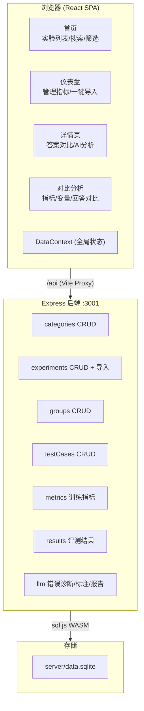
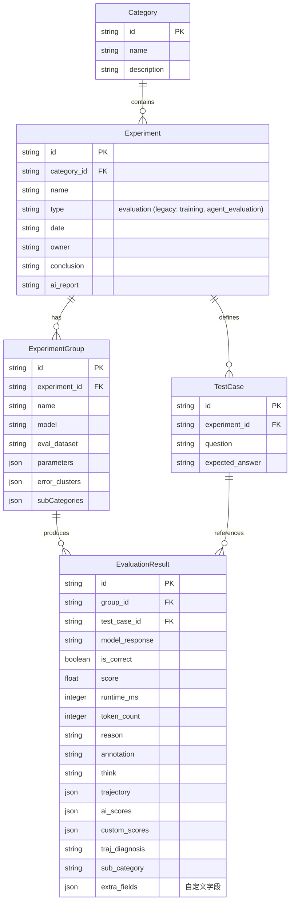
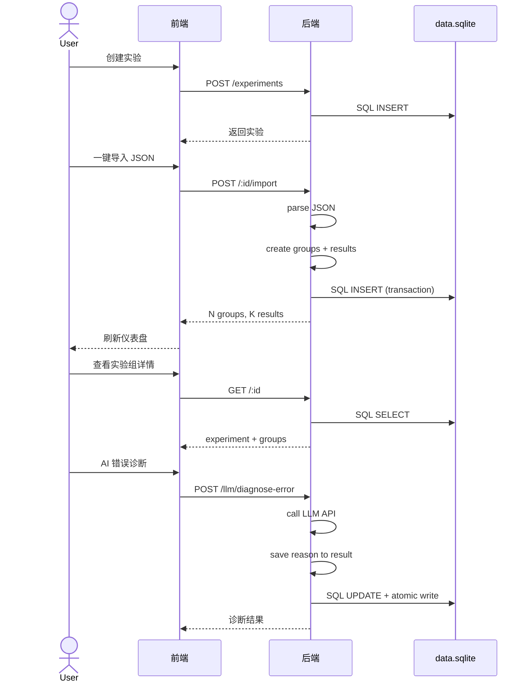
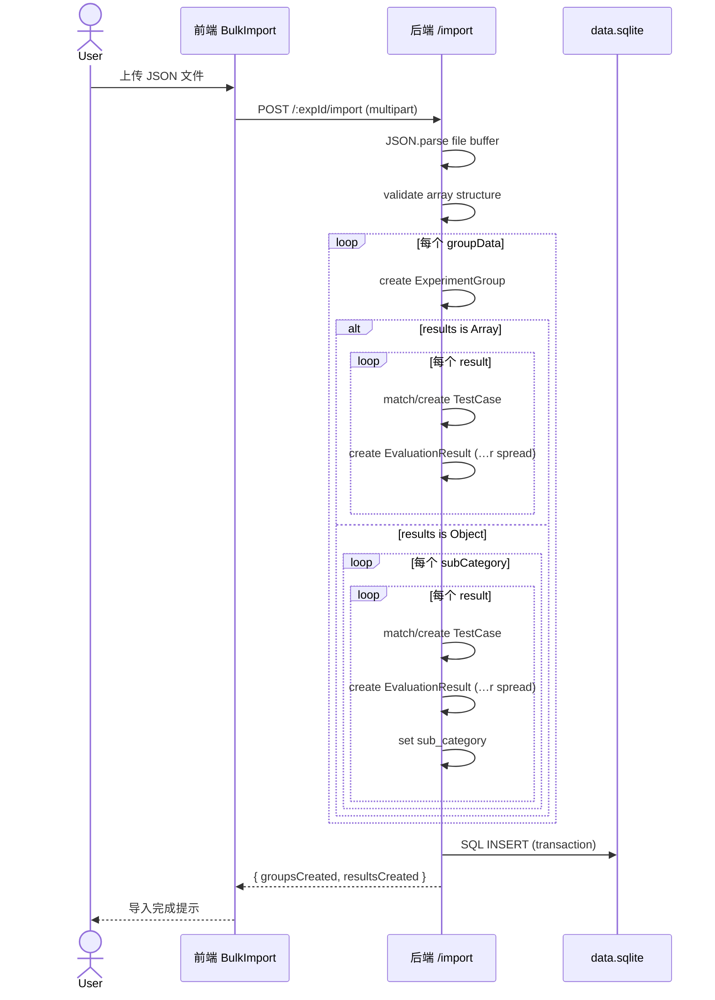

# 实验数据展示平台 — 开发文档

## 一、项目背景与需求

### 解决什么问题

AI 研发团队在日常工作中会产生大量实验结果数据：模型训练指标对比、NL2SQL 正确率评测、NER 准确率评测、Agent 工具调用评测等。这些数据分散在 CSV 文件、Excel 表格、Python 脚本日志中，缺乏统一的管理、对比和可视化平台。

**核心痛点**：
1. 多种实验类型（训练/评测/Agent）数据结构不同，无法统一管理
2. 评测结果几十到上百条，逐条录入效率低，缺少批量导入能力
3. 多维度实验对比需要手动制表，工作量大
4. Agent 执行轨迹无法追溯，只能看到最终正确/错误
5. 缺少 AI 辅助的错误诊断和自动标注能力

### 解决方案

提供一套完整的 Web 平台：**数据录入 → 统一管理 → 可视化对比 → AI 分析 → 轨迹追溯**。

---

## 二、技术栈

| 层 | 技术 | 选型原因 |
|---|------|---------|
| 前端框架 | React 19 + TypeScript | 类型安全，组件化 |
| UI 组件库 | Ant Design 6 | 企业级 Table/Card/Statistic/Modal |
| 图表 | Recharts 3 | React 原生，声明式 API |
| 路由 | React Router 7 | SPA 路由管理 |
| 构建 | Vite 8 | 秒级热更新 |
| 后端 | Express 4 | 轻量，适合本地/小团队 |
| 存储 | SQLite (sql.js WASM) | 零原生依赖，原子写入，Windows ARM64 兼容 |
| LLM 集成 | OpenAI-compatible API | 可接入 DeepSeek / 本地模型 |

---

## 三、架构设计

### 3.1 逻辑视图



### 3.2 数据模型 ER 图



### 3.3 评测实验核心流程



### 3.4 数据导入流程



## 四、页面功能说明

### 4.1 首页 `/`

**作用**：语料实验室总览，展示所有实验列表。

| 功能 | 说明 |
|------|------|
| 实验统计 | 显示实验类别数和实验总数 |
| 实验列表 | 表格展示所有实验（名称、类别、负责人、日期、实验组数） |
| 搜索筛选 | 按名称搜索、负责人筛选、日期范围筛选 |
| 创建实验 | 弹出表单，选择类别、填写名称/描述/负责人/日期 |
| 实验类别管理 | 跳转到 `/categories` 管理实验类别 |
| 行点击 | 点击实验行进入该实验的仪表盘 |

### 4.2 实验类别页 `/categories`

**作用**：管理实验类别（增删改查），卡片网格展示。

### 4.3 仪表盘 `/experiment/:id`

**作用**：单个实验的管理中心。

| 功能 | 说明 |
|------|------|
| 实验信息 | 名称、描述、负责人、AI 报告 |
| 实验结论 | 可编辑卡片，记录实验发现和备注 |
| 统计卡片 | 实验组数、最佳准确率、最佳组、平均耗时 |
| 实验组对比表 | 每个实验组一行，变量展开为列，支持排序筛选 |
| 子分组列 | 默认折叠，点击展开显示各子分组准确率 |
| 一键导入 | JSON 文件上传，自动创建实验组和结果 |
| 管理测试用例 | 逐条编辑或 JSON 批量上传测试用例 |
| AI 报告 | 点击生成/查看 LLM 自动生成的实验报告 |
| 对比分析 | 勾选多个实验组，点击对比进入对比分析页 |
| 行点击 | 点击实验组行进入该组的详情页 |

### 4.4 评测详情页 `/experiment/:id/group/:gid`

**作用**：展示单个实验组的所有评测结果。

**表格列**：
```
# | 子分组 | 题目 | 标准答案 | 模型回答 | 自定义字段... | 结果 | 原因 | 耗时 | Token | AI评分 | 标注 | Think
```

| 功能 | 说明 |
|------|------|
| 行复选框 | 勾选用例用于 AI 分析 |
| 列筛选 | 题目/标准答案/结果下拉筛选 |
| 列排序 | 所有列均可排序 |
| 文本搜索 | 跨列关键词搜索 |
| 计数 | 显示筛选后条数/总条数 + 已选条数 |
| AI 诊断 | 勾选错误用例，LLM 诊断原因，自动填入原因列 |
| AI 标注 | 勾选用例，LLM 四维度评分（正确性/完整性/简洁性/规范性），存入 AI评分列 |
| AI 聚类 | 对所有错误用例聚类分析，结果保存到实验组 |
| 标注列 | 点击编辑图标，手动填写人工标注 |
| Think 按钮 | 点击灯泡查看模型思考过程（如有） |
| 管理评测结果 | 弹窗：逐条添加/JSON批量上传/编辑/删除 |

### 4.5 Agent 详情页

与评测详情页类似，额外显示：
- 正确答案列
- Agent 回答列
- 步骤数、工具调用、工具错误列
- 轨迹按钮 → 弹窗带 🧠 Think（推理链）+ 💭 结论 + 🎬 行动 + 👁 观察
- AI 轨迹诊断 → LLM 诊断每步的不合理步骤和工具问题

### 4.6 对比分析页 `/experiment/:id/compare`

**作用**：对比多个实验组的表现。

| 功能 | 说明 |
|------|------|
| 指标对比 | 多选指标，每个指标一张小柱状图（按实验组颜色区分） |
| 支持指标 | 准确率、子分组准确率、平均耗时、总Token、平均工具调用、数值型变量 |
| 变量差异表 | 各实验组变量的对比表 |
| 共同用例对比 | 各组回答并排展示，带搜索和正确性筛选 |
| AI 对比评析 | LLM 分析两组回答差异 |

---

## 五、使用指南

### 5.1 快速开始

```bash
npm install
npm run dev
```

前端 http://localhost:5173，后端 http://localhost:3001。

### 5.2 创建实验并导入数据

1. 首页点击「创建实验」→ 选择类别 → 填写名称/日期/负责人
2. 进入实验仪表盘 → 点击「一键导入」→ 上传 JSON 文件
3. 导入完成后仪表盘显示所有实验组和指标

### 5.3 使用 AI 分析

1. 顶部导航栏点击「LLM」→ 配置 API 地址、模型名称、API Key → 测试连接 → 保存
2. 进入实验组详情 → 勾选错误用例 → AI 分析下拉 → 选择诊断/标注/聚类
3. 仪表盘点击「AI 报告」→ 首次生成，再次查看

### 5.4 对比实验组

1. 仪表盘勾选实验组（可多选）→ 点击「对比选中组」
2. 指标对比卡 → 下拉选择要对比的指标 → 多张小图展示
3. 变量差异表对比各组参数
4. 共同用例对比表查看各组回答差异

---

## 六、一键导入 JSON 格式

### 6.1 基本结构

```json
[
  {
    "group_name": "GPT-4o",
    "model": "gpt-4o",
    "eval_dataset": "评测集名称",
    "variables": { "temperature": 0.7 },
    "results": [ ... ]
  }
]
```

### 6.2 实验组字段

| 字段 | 类型 | 必填 | 说明 |
|------|------|:--:|------|
| `group_name` | string | ✅ | 实验组名称 |
| `model` | string | | 模型标识 |
| `eval_dataset` | string | | 评测集名称 |
| `variables` | object | | 实验变量键值对（如 `{"lr":0.1}`） |

### 6.3 评测结果字段（results[]）

| 字段 | 类型 | 必填 | 说明 |
|------|------|:--:|------|
| `question` | string | ✅ | 题目 |
| `expected_answer` | string | | 标准答案 |
| `model_response` | string | | 模型回答 |
| `is_correct` | boolean | | 是否正确 |
| `score` | number | | 得分（0~1，可选自定义字段） |
| `runtime_ms` | integer | | 耗时（毫秒） |
| `token_count` | integer | | Token 消耗 |
| `reason` | string | | 错误原因 |
| `annotation` | string | | 人工标注 |
| `think` | string | | 思考过程（简单评测） |
| `case_id` | string | | 用例编号 |
| `trajectory` | array | | Agent 轨迹 |
| *自定义字段* | any | | 如 `difficulty`, `table_count`，自动显示为列 |

### 6.4 轨迹步骤字段（trajectory[]）

| 字段 | 类型 | 说明 |
|------|------|------|
| `step` | integer | 步骤序号 |
| `think` | string | 模型推理链（可长） |
| `thought` | string | 模型得出的结论（简短） |
| `action` | string | 该步骤执行的动作 |
| `observation` | string | 观察到的结果 |
| `tool` | string | 使用的工具名 |
| `tool_input` | string | 工具输入 |
| `tool_output` | string | 工具输出 |

### 6.5 子分组格式（嵌套 results）

当评测用例可以按类型分组时（如 NL2SQL 的「单表查询」「多表查询」），使用嵌套格式：

```json
"results": {
  "单表查询": [
    { "question": "...", "is_correct": true }
  ],
  "多表查询": [
    { "question": "...", "is_correct": false }
  ]
}
```

平台自动识别 `sub_category` 字段，在仪表盘展示各子分组的准确率列。

### 6.6 JSON 文件示例

项目根目录提供多个示例文件：

| 文件 | 实验组 | 特点 |
|------|--------|------|
| `sample_eval_noscore.json` | 4组×15题 | 无 score 字段 |
| `sample_eval_subcat.json` | 5组×15题 | 嵌套子分组 + think |
| `sample_eval_think.json` | 5组×15题 | 平铺结果 + think |
| `sample_nl2sql.json` | 5组×28题 | 子分组 + 自定义字段 |
| `sample_agent_v3.json` | 6组×24题 | Agent轨迹 + 每步think |

---

## 七、API 接口一览

| 资源 | 方法 | 路径 | 说明 |
|------|------|------|------|
| 类别 | GET/POST | `/api/categories` | 列表/创建 |
| 类别 | PUT/DELETE | `/api/categories/:id` | 更新/删除 |
| 实验 | GET/POST | `/api/experiments` | 列表/创建 |
| 实验 | GET | `/api/experiments/:id` | 详情(含实验组) |
| 实验 | POST | `/api/experiments/:id/import` | JSON 一键导入 |
| 实验 | PUT/DELETE | `/api/experiments/:id` | 更新/删除 |
| 实验组 | GET/POST | `/api/experiments/:id/groups` | 列表/创建 |
| 实验组 | PUT/DELETE | `/api/groups/:id` | 更新/删除 |
| 测试用例 | GET/POST | `/api/experiments/:id/test-cases` | 列表/创建 |
| 测试用例 | POST | `/api/experiments/:id/test-cases/upload` | JSON 批量 |
| 评测结果 | GET | `/api/groups/:id/results` | 列表(含统计) |
| 评测结果 | POST | `/api/groups/:id/results` | 创建 |
| 评测结果 | POST | `/api/groups/:id/results/upload` | JSON 批量 |
| 评测结果 | PUT/DELETE | `/api/results/:id` | 更新/删除 |
| LLM配置 | GET/PUT | `/api/llm/config` | 获取/保存 |
| LLM诊断 | POST | `/api/llm/diagnose-error` | 错误诊断 |
| LLM标注 | POST | `/api/llm/auto-annotate` | 自动标注 |
| LLM聚类 | POST | `/api/llm/cluster-errors` | 错误聚类 |
| LLM对比 | POST | `/api/llm/compare-analysis` | 对比评析 |
| LLM轨迹 | POST | `/api/llm/diagnose-trajectory` | 轨迹诊断 |
| LLM报告 | POST | `/api/llm/generate-report` | 实验报告 |
